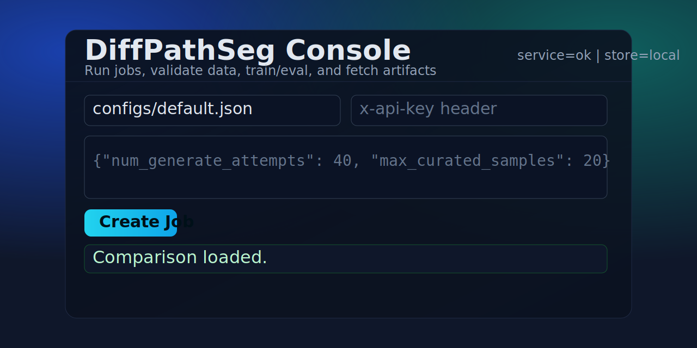

# DiffPathSeg

Production-ready **Diffusion-Augmented Segmentation** pipeline for rare medical pathologies, exposed as a FastAPI service with an operations UI.



## Overview

DiffPathSeg builds a model-in-the-loop synthetic data factory:

- Generates pathology-like abnormalities on normal images.
- Curates generated data through validation and quality checks.
- Runs baseline vs augmented training evaluation.
- Logs experiment outcomes for quick comparison.
- Exposes artifacts and reports through API + web console.

## Live Service

- API/UI base URL: [https://diffpathseg-api.onrender.com](https://diffpathseg-api.onrender.com)
- Health check: [https://diffpathseg-api.onrender.com/healthz](https://diffpathseg-api.onrender.com/healthz)

## Console Features

- Create generation job
- Track existing `job_id`
- Run validation report
- Run training/evaluation (Dice/IoU lift)
- Compare recent experiments
- Browse artifacts (`.png`, `.pgm`)
- Download artifacts as ZIP

## API Endpoints

- `GET /` - Web console
- `GET /healthz` - Health probe
- `POST /v1/jobs` - Create job
- `GET /v1/jobs/{job_id}` - Job status
- `GET /v1/jobs/{job_id}/validation` - Validation summary
- `GET /v1/jobs/{job_id}/train_eval` - Baseline vs augmented metrics
- `GET /v1/experiments` - Experiment history/comparison summary
- `GET /v1/jobs/{job_id}/artifacts` - Artifact manifest
- `GET /v1/jobs/{job_id}/artifacts/{bucket}/{filename}` - Download single artifact
- `GET /v1/jobs/{job_id}/artifacts.zip` - Download all artifacts

## Local Development

```bash
pip install -r requirements.txt
python -m app.main serve --host 0.0.0.0 --port 8000
```

Open [http://localhost:8000/](http://localhost:8000/).

## Configuration

Default config path is `configs/default.json`.

Optional request-level override:

```json
{"num_generate_attempts": 40, "max_curated_samples": 20}
```

## Environment Variables

- `APP_API_KEY` - Optional API key; sent as `x-api-key`
- `APP_DEFAULT_CONFIG` - Default config file path
- `MAX_CONCURRENT_JOBS` - Worker concurrency cap
- `LOG_LEVEL` - Service logging level
- `EXPERIMENTS_LOG_PATH` - Experiment log file
- `ARTIFACT_STORE` - `local` (default) or `s3`
- `S3_BUCKET`, `S3_REGION`, `S3_PREFIX`, `S3_PRESIGN_EXPIRY_SECONDS`, `S3_PUBLIC_BASE_URL` - Optional S3 persistence settings

## Deployment

This repo includes `Dockerfile` and `render.yaml` for Render deployment.

1. Push repository to GitHub.
2. Create a Render Blueprint from the repository.
3. Deploy service `diffpathseg-api`.
4. Open `/` for UI and `/healthz` for health.

## Notes

- Render free tier can cold-start after inactivity.
- Local artifact storage is ephemeral on free tier; use S3 mode for durable retention.
